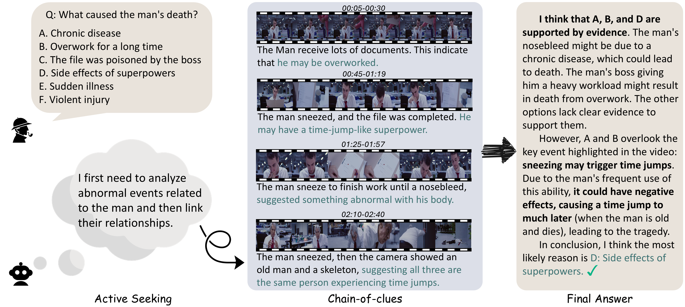
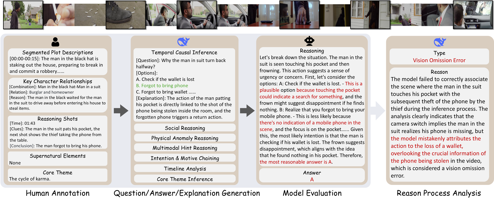

<p align="center">
  
</p>
<hr>
<div align="center">

## Video-Holmes: Can MLLM Think Like Holmes for Complex Video Reasoning?


**[Junhao Cheng<sup>1,2</sup>](https://donahowe.github.io/), 
[Yuying Ge<sup>1,&#9993;</sup>](https://geyuying.github.io/), 
[Teng Wang<sup>1,&#9993;</sup>](http://ttengwang.com/), 
[Yixiao Ge<sup>1</sup>](https://geyixiao.com/), 
[Jing Liao<sup>2</sup>](https://scholar.google.com/citations?user=3s9f9VIAAAAJ&hl=en), 
[Ying Shan<sup>1</sup>](https://scholar.google.com/citations?user=4oXBp9UAAAAJ&hl=en)**
<br>
<sup>1</sup>ARC Lab, Tencent PCG, 
<sup>2</sup>City University of Hong Kong
<br>

<a href="https://video-holmes.github.io/Page.github.io/" target="_blank">
    
</a>

<a href="http://arxiv.org/abs/2505.21374" target="_blank">
    
</a>

<a href="https://huggingface.co/datasets/TencentARC/Video-Holmes" target="_blank">
    
</a>
</div>

## 🔎 Introduction

Video-Holmes is <b>a benchmark designed to evaluate the complex video reasoning capabilities of MLLMs</b>. 

Video-Holmes consists of 1,837 questions derived from 270 manually annotated <b>suspense short films</b> (ranging from 1 to 5 minutes), which spans <b>seven carefully designed tasks</b>. Each task is constructed by first identifying key events and causal relationships within films, and then designing questions that require models to <b>actively locate and connect multiple relevant visual clues scattered across different video segments</b>.

⭐ Key Aspects of Video-Holmes:

<ul style="list-style-type: disc; padding-left: 20px;">
<li><b>One-Click Evaluation:</b> Videos, questions, and evaluation codes are packaged on GitHub and <a href="https://huggingface.co/datasets/TencentARC/Video-Holmes" target="_blank">Huggingface</a>.</li>
<li><b>High Reasoning Demand:</b> Significant performance gap between reasoning models and non-reasoning models.</li>
<li><b>Reasoning Process Analysis:</b> Clearly visualizes the reasons behind correct and incorrect model responses.</li>
</ul>

We aim that Video-Holmes can serve as a <i>"Holmes-test"</i> for multimodal reasoning, motivating models to reason more like humans and emphasizing the ongoing challenges in this field. Please visit our [homepage](https://video-holmes.github.io/Page.github.io/) for more details!




## 📅 News

* [2025-05-29] We released the training set of Video-Holmes, which consists of 233 videos and 1,551 questions.🔥🔥🔥
* [2025-05-28] We released Video-Holmes and corresponding evaluation code.🔥🔥🔥

## 🚩 Plan
- [x] Release suspense short film annotations
- [x] Release benchmark construction codes
- [x] Release training data

## 🏆 Leaderboard
🏅 Best performance model: [Gemini-2.5-Pro](https://gemini.google.com/)

🏅 Best thinking model based on Qwen2.5-VL-7B: [Video-R1](https://github.com/tulerfeng/Video-R1)

➡️ [Full leaderboard](https://video-holmes.github.io/Page.github.io#leaderboard)

> Welcome to contact us at Howe4884@outlook.com to upload your model to the leaderboard.


## 🚀 Quick Start

To download Video-Holmes, you can run the following commands:
```shell
git clone https://github.com/TencentARC/Video-Holmes.git
cd Video-Holmes
pip install huggingface_hub
python download.py --hf_token YOUR_HUGGINGFACE_ACCESS_TOKEN
unzip Benchmark/videos.zip -d Benchmark/
unzip Benchmark/annotations.zip -d Benchmark/
```

We provide all-in-one evaluation codes for baseline models:
```shell
python evaluate.py --model_name YOUR_MODEL_NAME --model_path YOUR_MODEL_PATH (optional)
```

Supported Model List:

| QwenVL | QwenVL-RL | InternVL | Gemini |
|----------------|----------------|----------------|----------------|
| Qwen2.5-VL-7B  | VideoChat-R1  | InternVL2.5-8B | gemini-2.0-flash |
| Qwen2.5-VL-32B | Video-R1  | InternVL3-8B | gemini-2.0-pro-exp | 

You can also customize your model by specifying the `--model_path` argument, or by implementing the following functions: `prepare_your_model` (line 388) and `generate_your_model` (line 439).

<details>
<summary><b>🧐 Reasoning Process Analysis</b></summary>
  
You first need to apply a [DeepSeek API key](https://platform.deepseek.com/api_keys) and then you can run the following commands to analyze the reasoning process of your models:

```shell
python evaluate_reasoning.py --model_name YOUR_MODEL_NAME --api_key YOUR_API_KEY
```

</details>

<details>
<summary><b>🪄 Generate Your Holmes-Test</b></summary>
  
To generate questions for your videos with annotations, you can run the following commands:

```shell
cd Pipeline
python generate_questions.py --api_key YOUR_API_KEY
```

> Note: You can down load the video on YouTube according to the `VIDEO_ID` by `https://www.youtube.com/watch?v=VIDEO_ID`
</details>


## 🛠️ Construction Pipeline

We select 270 high-quality suspense short films for human annotation. Next, we design 7 challenging tasks and employ DeepSeek to generate questions. Finally, we evaluate SOTA MLLMs and use DeepSeek to analyze their responses (optional).


## 🗝️ Question Types

Existing benchmarks primarily involve clue-given questions, where models depend on explicitly provided clues to derive answers. In contrast, Video-Holmes adopts an active seeking paradigm, requiring models to actively locate and connect multiple relevant visual clues scattered across different video segments.


## :closed_book: License
- Video-Holmes is released under the Apache-2.0 license for academic purpose only.
- All videos of the Video-Holmes are obtained from the Internet which are not property of our institutions. Our institution are not responsible for the content nor the meaning of these videos. The copyright remains with the original owners of the video.
- If any video in our dataset infringes upon your rights, please contact us for removal.
  
## 📜 Citation

If you find our work helpful, please consider giving a star ⭐ and citation 📝

```BibTeXw
Todo
```

## 🤗 Acknowledgements

We refer to [MovieDreamer](https://github.com/aim-uofa/MovieDreamer) and [VCR-Bench](https://github.com/zhishuifeiqian/VCR-Bench) to build our codebase and homepage. Thanks for their wonderful project.
